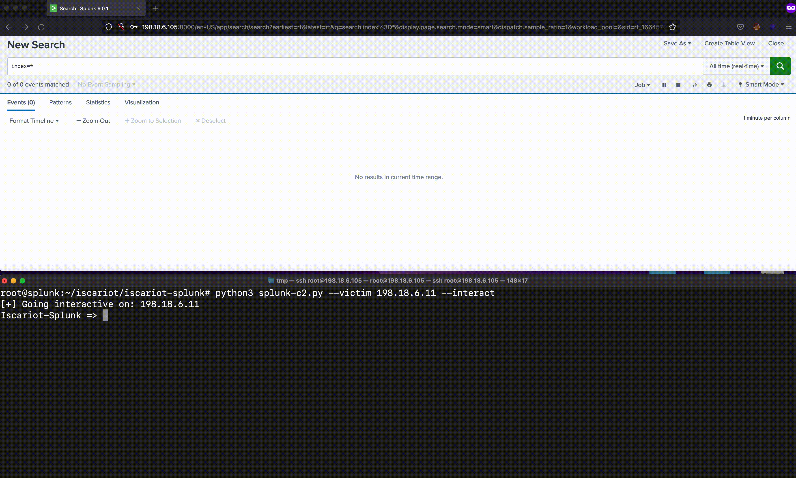

# Iscariot Suite

<div align="center">

</div>
</div>

The Iscariot Suite is a collection of tools to enhance and augment trusted open-source and commercial Blue Team/Sysadmin products, turning them into traitorware to achieve offensive security goals. The Iscariot Suite takes its name from the famous traitor Judas Iscariot, who - according to biblical tradition - betrayed Jesus.

The Iscariot Suite was discussed in the presentation "Stop writing malware! The Blue team has done it for you!" The slides for this presentation are in this repo.

```
Traitorware (noun)
trai·​tor·​ware | \ˈtrā-tər-ˌwer\

1 : software that betrays the trust placed in it to perform malicious actions
2 : trusted software with benign original intent used for malicious actions

// The red team bypassed all our detections using traitorware.
```

## Iscariot-Splunk

- Uses Splunk native features to act as a full-blown Command and Control framework. The agent component is possible by installing the splunk universal forwarder. The server component is the standard Splunk Enterprise server.


<div align="center">

</div>
</div>


## Iscariot-Osquery

- Using an osquery extension, a user can execute binaries, shell commands, unmodified Cobalt Strike BOFs, and C# assemblies in memory
- The extension runs as its own process, but a child of the digitally signed osqueryd.exe

<div align="center">

</div>
</div>


---
## References/Credits:

- [2021 Adversary Infrastructure Report](https://go.recordedfuture.com/hubfs/reports/cta-2022-0118.pdf)
- [The C2 Matrix](https://www.thec2matrix.com/matrix)
- [Cobalt Strike specific YARA rules](https://cs.github.com/?scopeName=All+repos&scope=&q=language%3Ayara+AND+%28%22Cobalt+Strike%22+OR+%22cobaltstrike%22%29)
- [Easily Identify Malicious Servers on the Internet with JARM](https://engineering.salesforce.com/easily-identify-malicious-servers-on-the-internet-with-jarm-e095edac525a)
- [Red Canary - 2022 Threat Detection Report](https://resource.redcanary.com/rs/003-YRU-314/images/2022_ThreatDetectionReport_RedCanary.pdf)
- [Rule against Offsec tool author handles](https://github.com/wagga40/Zircolite/blob/master/rules/rules_windows_generic.json#L2531)
- [Cobalt Strike, a Defender’s Guide](https://thedfirreport.com/2021/08/29/cobalt-strike-a-defenders-guide/)
- [Cobalt Strike, a Defender’s Guide – Part 2](https://thedfirreport.com/2022/01/24/cobalt-strike-a-defenders-guide-part-2/)
- [Inno-shellcode-example](https://github.com/DarkCoderSc/inno-shellcode-example/)
- [Dumping Memory with AV - Avast Home Security](https://www.archcloudlabs.com/projects/dumping-memory-with-av/)
- [Backstab](https://github.com/Yaxser/Backstab)
- [OffensivePH](https://github.com/RedSection/OffensivePH)
- [Using Power Automate for Covert Data Exfiltration in Microsoft 365](https://www.varonis.com/blog/power-automate-data-exfiltration)
- [Quick Tunnels: Anytime, Anywhere](https://blog.cloudflare.com/quick-tunnels-anytime-anywhere/)
- [Living Off Trusted Sites (LOTS) Project](https://lots-project.com/)
- [Splunk Universal Forwarder Hijacking](https://airman604.medium.com/splunk-universal-forwarder-hijacking-5899c3e0e6b2)
- [Splunk Universal Forwarder Hijacking 2: SplunkWhisperer2](https://clement.notin.org/blog/2019/02/25/Splunk-Universal-Forwarder-Hijacking-2-SplunkWhisperer2/)
- [How to Leverage Splunk as an Offensive Security Tool](https://hurricanelabs.com/splunk-tutorials/how-to-leverage-splunk-as-an-offensive-security-tool/)
- [Abusing Splunk Forwarders For Shells and Persistence](https://eapolsniper.github.io/2020/08/14/Abusing-Splunk-Forwarders-For-RCE-And-Persistence/)
- [osquery](https://osquery.io/)
- [fleet](https://fleetdm.com/)
- [sliver](https://github.com/BishopFox/sliver)
