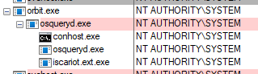
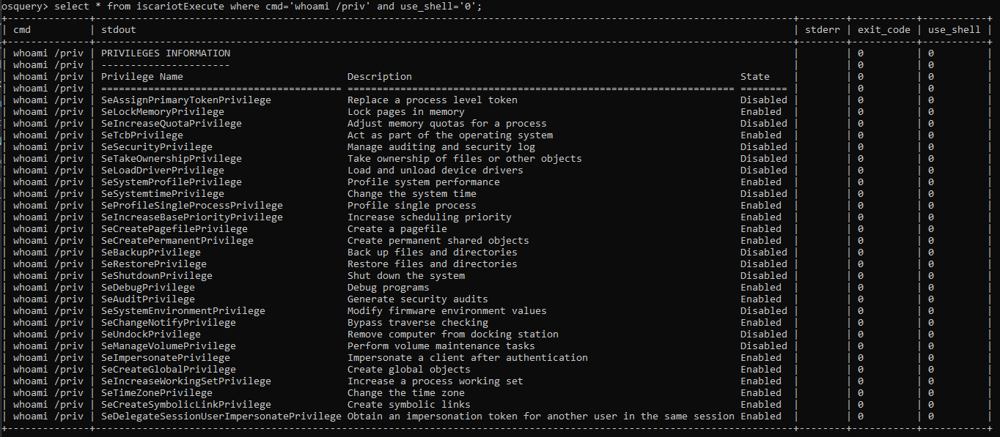
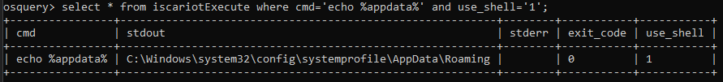
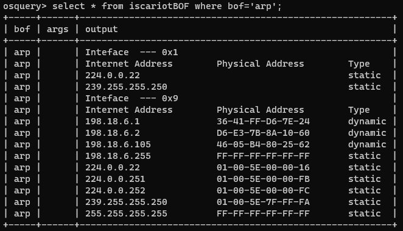
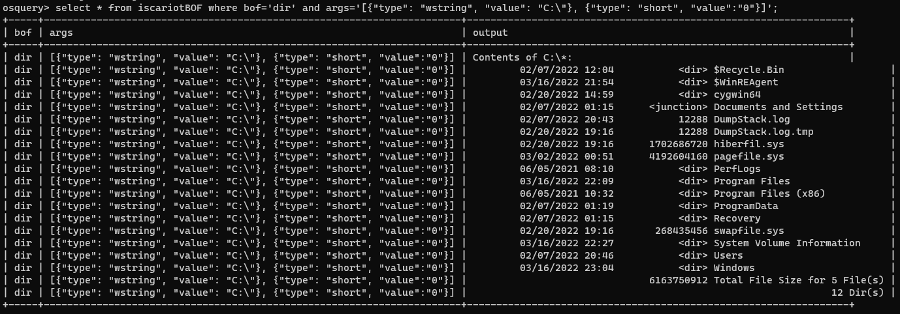

# Iscariot - Osquery

- Using an osquery extension, a user can execute binaries, shell commands, unmodified Cobalt Strike BOFs, and C# assemblies in memory

- The extension runs as its own process, but a child of the digitally signed osqueryd.exe

<div align="center">

</div>
</div>

## Windows Testing

```powershell
# In one Administrator shell (osqueryi.exe is part of the official osquery install from osquery.io)
osqueryi.exe
# In another Administrator shell:
go build -ldflags "-s -w" -trimpath
iscariot.exe --socket \\.\pipe\shell.em
# Back in first shell
select * from iscariotExecute where cmd='whoami /priv' and use_shell='0';
select * from iscariotExecute where cmd='whoami /priv' and use_shell='1';
select * from iscariotBOF where bof='arp';
select * from iscariotBOF where bof='whoami';
select * from iscariotBOF where bof='dir' and args='[{"type": "wstring", "value": "C:\"}, {"type": "short", "value":"0"}]';
# Any bof from TrustedSec's SA BOF collection will work. You'll need to get the arg types manually from BOF src for now...
select * from iscariotExecuteAssembly where assembly='seatbelt' and args='-group=user'
```

## Windows setup for use with Fleet/Orbit (in Administrator powershell)

```powershell
# Obtain and run an Orbit deployment package from your fleet server
fleet_osquery.msi /i /quiet /qn /norestart
# Navigate the the Orbit directory
cd C:\Program Files\Orbit
# Make a folder to hold our extension
mkdir extensions
# Copy the extension
cp C:\path\to\iscariot.exe extensions\iscariot.ext.exe
# Set proper permissions on the folder or osquery will complain
icacls .\extensions /setowner Administrators /t
icacls .\extensions /grant Administrators:f /t
icacls .\extensions /inheritance:r /t
icacls .\extensions /inheritance:d /t
# Create a file that will direct osquery which extensions to load
"C:\Program Files\Orbit\extensions\iscariot.ext.exe" | out-file extensions.load -Encoding ASCII

# Set the proper file permissions
icacls .\extensions.load /setowner Administrators /t

# Create the osquery.flags file that will load the extension
"--extensions_autoload=C:\Program Files\Orbit\extensions.load" | out-file osquery.flags -Encoding ASCII -Append
"--extensions_timeout=3" | out-file osquery.flags -Encoding ASCII -Append
"--extensions_interval=3" | out-file osquery.flags -Encoding ASCII -Append
# for testing this flag can be used if permissions are not correct
"--allow_unsafe" | out-file osquery.flags -Encoding ASCII -Append

# restart orbit/osquery (the .exe is required in powershell)
sc.exe stop "Fleet osquery"
sc.exe start "Fleet osquery"

# If all goes well iscariot.ext.exe should be running as a child process of orbit and osqueryd
```

## Screenshots

Iscariot in the process list



Iscariot running a command directly



Iscariot running a command in a shell



Iscariot running an unmodified Cobalt Strike BOF in memory (loader and BOF never touch disk)



Iscariot running an unmodified Cobalt Strike BOF in memory (loader and BOF never touch disk) with args


