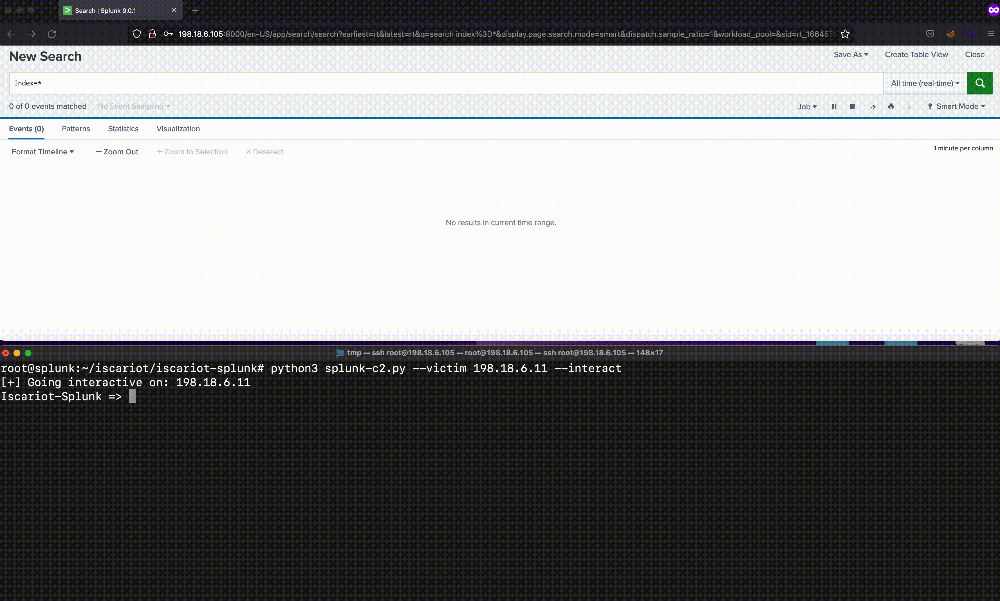

# Splunk-as-C2

- This project uses Splunk native features to act as a full-blown Command and Control framework. The agent component is possible by installing the splunk universal forwarder. The server component is the standard Splunk Enterprise server. 

- "A deployment server is a Splunk Enterprise instance that acts as a centralized configuration manager for any number of other instances, called deployment clients. Any full Splunk Enterprise instance - even one indexing data locally - can act as a deployment server. A deployment server cannot be a client of itself" - Splunk

- The splunk server also serves as a deployment server to all our implants. This allows us to create malicious applications, push them down to the agents, execute commands (batch, powershell (splunk signed binary), and wmi (splunk signed binary)). 


## Required Scenarios

Below are two scenarios in which you may deploy this "Splunk-as-C2" infrastructure:

1. If you're an attacker with the Splunk Universal Forward Agent username:password. This means you are leveraging the existing infrastructure to run reach your objectives with Splunk.

2. You have gained code execution and want to use the entire Splunk suite as your C2 infrastructure :). Respectable option for persistence, especially if you decide to fully leverage the `splunk-powershell.exe` and `splunk-wmi.exe` binaries. 

<p align="center">
    
</p>

<div align="center">

</div>
</div>

## Installation

```bash
cd iscariot-splunk
apt-get install python3-venv
apt-get install python3-pip
python3 -m venv .venv
source .venv/bin/activate
pip install -r requirements.txt
```

## Usage

- Execute a single command on a single or multiple hosts: `python3 splunk-c2.py --victim 198.168.1.5 --command <command-here>`

<p align="center">
    
</p>

- Go a bit interactive (Pretty slow. Not interactive in the traditional sense This is useful if your team will dev future capabilities): `python3 splunk-c2.py --victim 198.168.1.5 --interactive`

<p align="center">
    
</p>

<p align="center">
    
</p>


## Other Notable Components

A `deployment client` is a Splunk instance remotely configured by a deployment server. Deployment clients can be universal forwarders, heavy forwarders, indexers, or search heads. Each deployment client belongs to one or more server classes.

A `deployment app` is a set of content (including configuration files) maintained on the deployment server and deployed as a unit to clients of a server class. A deployment app might consist of just a single configuration file, or it can consist of many files. Over time, an app can be updated with new content and then redeployed to its designated clients. The deployment app can be an existing Splunk Enterprise app or one developed solely to group some content for deployment purposes.

A `server class` is a group of deployment clients that share one or more defined characteristics. For example, you can group all Windows clients into one server class and all Linux clients into another server class. You use server classes to map a group of deployment clients to one or more deployment apps. By creating a server class, you are telling the deployment server that a specific set of clients should receive configuration updates in the form of a specific set of apps.

### Credits

Prior research has been done on weaponizing Splunk. Some of the examples below do touch on using Splunk as a C2 framework.  

- [Splunk Universal Forwarder Hijacking](https://airman604.medium.com/splunk-universal-forwarder-hijacking-5899c3e0e6b2)

- [Splunk Universal Forwarder Hijacking 2: SplunkWhisperer2](https://clement.notin.org/blog/2019/02/25/Splunk-Universal-Forwarder-Hijacking-2-SplunkWhisperer2/)

- [How to Leverage Splunk as an Offensive Security Tool](https://hurricanelabs.com/splunk-tutorials/how-to-leverage-splunk-as-an-offensive-security-tool/)

- [Abusing Splunk Forwarders For Shells and Persistence](https://eapolsniper.github.io/2020/08/14/Abusing-Splunk-Forwarders-For-RCE-And-Persistence/)